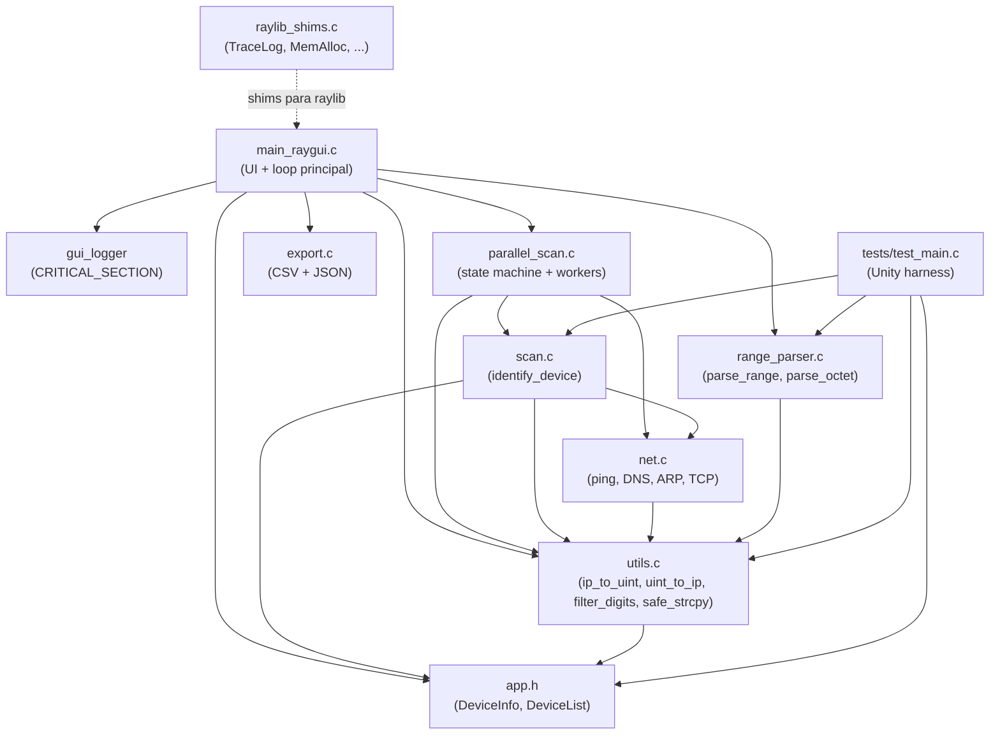
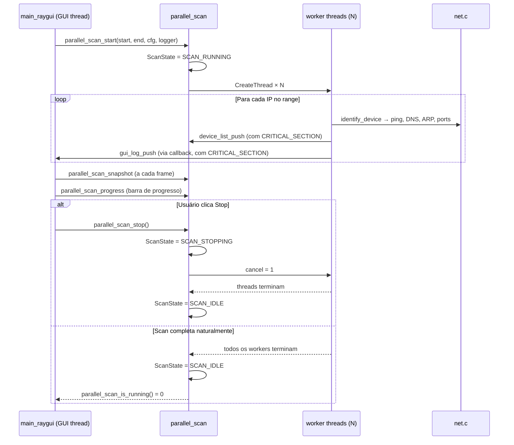
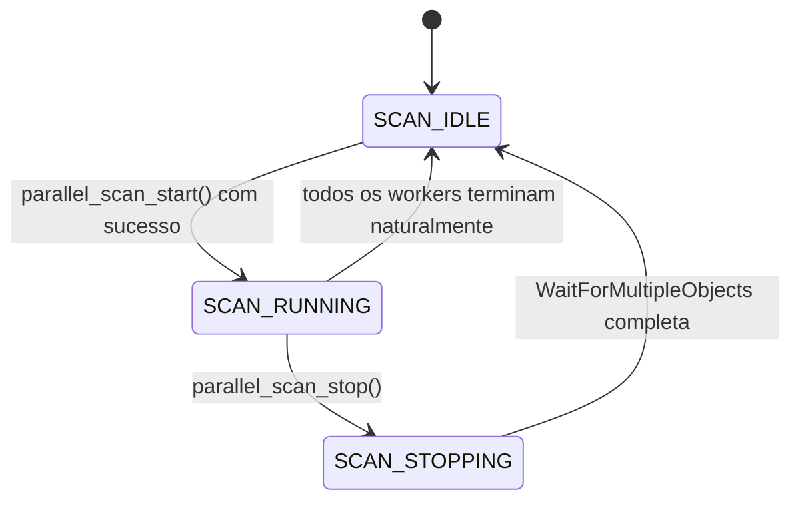

# Design Document — CatNet Scanner Hardening

## Overview

Este documento descreve a arquitetura técnica e as decisões de design para o conjunto de melhorias do CatNet Scanner (hardening). O CatNet Scanner é um utilitário Windows com GUI para diagnóstico de rede, escrito em C puro, usando raylib/raygui para a interface gráfica, WinSock2 para operações de rede TCP/UDP, ICMP API para ping e IP Helper API para ARP e enumeração de adaptadores.

O escopo deste hardening cobre 16 áreas: refatoração da UI, separação de módulos, eliminação de estado global inseguro, máquina de estados explícita para scan paralelo, validação rigorosa de ranges, logger thread-safe, migração de APIs deprecadas, correção do uso de ICMP, verificação de privilégios, melhorias de UX, exportação CSV/JSON, testes unitários, CI com GitHub Actions, padronização de estilo e atualização da documentação.

### Objetivos de Design

- **Segurança de concorrência**: eliminar condições de corrida entre a thread da GUI e os workers de scan.
- **Correção de APIs**: substituir todas as APIs Win32 deprecadas por equivalentes modernos.
- **Testabilidade**: isolar lógica pura (parsing, conversão de IP, exportação) de efeitos colaterais (rede, UI).
- **Manutenibilidade**: funções com responsabilidade única, módulos coesos, estilo uniforme.
- **UX**: feedback visual preciso do progresso, estados de botão corretos, exportação integrada.

### Divergências identificadas na revisão do código real

A revisão do código-fonte atual (`src/main_raygui.c`, `src/scan.c`, `src/parallel_scan.c`, `src/net.c`, `src/utils.c`) revelou que **nenhuma** das refatorações de UI descritas neste documento existe no código — apenas comentários de seção inline. As correções abaixo foram incorporadas ao design para refletir o estado real e garantir que as tarefas de implementação sejam precisas:

1. **`parse_range` está em `main_raygui.c`** — função de parsing puro sem dependência de raylib, mas embutida no arquivo de UI. Deve ser movida para `src/range_parser.c` / `src/range_parser.h` para ser testável e reutilizável.
2. **Estado da UI em 17 variáveis estáticas globais** — `quickToolsExpanded`, `ipQ1..4`, `splitterRatio`, etc. espalhadas no topo do arquivo, mais `ipRangeText`/`ipRangeEdit` como `static` dentro de `main()`, e `selectedIndex`/`scroll`/`dbgScroll` como locais de `main()`. Devem ser consolidadas em `UIState`.
3. **Lógica de filtragem de octetos duplicada 4×** — o mesmo bloco de filtragem de dígitos e validação de octeto é repetido literalmente para `ipQ1`, `ipQ2`, `ipQ3`, `ipQ4`. Deve ser substituído por `filter_digits()` e `parse_octet()`.
4. **Lógica de negócio inline nos botões** — o handler do botão "Scan" contém ~30 linhas com chamadas a `net_get_primary_subnet`, `parse_range`, `ip_to_uint` e `parallel_scan_start`. Deve ser extraído para `action_start_scan()`.
5. **`parallel_scan_progress()` não existe** — a função está documentada no design mas não implementada em `parallel_scan.c`. A barra de progresso na UI também não existe.
6. **`g_logger` global ainda presente em `scan.c`** — `static ScanLogFn g_logger` e `scan_set_logger` existem no código atual. O worker de `parallel_scan.c` chama `identify_device(&di, &st->cfg)` sem passar logger, fazendo os logs de ping/DNS/MAC/ports irem para o global em vez do logger do scan.
7. **`lanOnly` declarada mas nunca usada** — dead code a ser removido junto com a consolidação do estado.
8. **Shims de raylib em `utils.c`** — `TraceLog`, `MemAlloc`, `MemRealloc`, `MemFree`, `LoadFileData`, etc. estão no final de `utils.c`, confirmando a necessidade de migração para `raylib_shims.c`.
9. **`net.c` usa `LoadLibraryA("Icmp.dll")`** — confirmado no código: `net_ping_ipv4` carrega dinamicamente `Icmp.dll` a cada chamada, obtém ponteiros via `GetProcAddress` e chama `FreeLibrary` ao final. Deve ser substituído por linkagem direta.
10. **APIs deprecadas confirmadas** — `inet_addr` em `net.c` (4 funções) e `utils.c`, `inet_ntoa` em `utils.c`, `gethostbyaddr` em `net.c`.

---

## Architecture

O projeto é organizado como um único executável Windows (`bin/catnet_scanner.exe`). Não há bibliotecas dinâmicas próprias — toda a lógica é compilada estaticamente. O diagrama abaixo mostra as dependências entre módulos após o hardening:



### Fluxo de Execução Principal



---

## Components and Interfaces

### 1. `src/main_raygui.c` — UI refatorada

**Estado atual (código real):** `main()` tem ~390 linhas de rendering inline com 17 variáveis estáticas globais espalhadas. Comentários de seção existem mas nenhuma função foi extraída. A variável `lanOnly` é dead code.

O arquivo principal é refatorado para extrair cada bloco de renderização em uma função dedicada. O estado da UI é consolidado em `UIState`. Ações de botão são extraídas para funções `action_*` separando lógica de negócio de rendering.

**Funções de rendering extraídas:**

```c
// Renderiza a toolbar superior com botões Scan, Stop, Export CSV/JSON, Quick Tools
// Retorna a ação disparada (TOOLBAR_ACTION_NONE, TOOLBAR_ACTION_SCAN, etc.)
static void draw_toolbar(UIState* ui, DeviceList* results, ScanConfig* cfg);

// Renderiza o painel de configuração (IP Range/CIDR, checkboxes)
static void draw_config_panel(UIState* ui, Rectangle area);

// Renderiza o painel Quick Tools (octetos de IP + botões Ping/DNS/Ports)
static void draw_quick_tools(UIState* ui, Rectangle area, ScanConfig* cfg);

// Renderiza a tabela de resultados com scroll, zebra stripes e colunas ordenáveis
static void draw_results_table(UIState* ui, Rectangle area, DeviceList* results);

// Renderiza o terminal de debug com scroll
static void draw_debug_log(UIState* ui, Rectangle area);

// Renderiza a barra de status inferior
static void draw_status_bar(UIState* ui, Rectangle area, DeviceList* results);
```

**Funções de ação extraídas (lógica de negócio fora do rendering):**

```c
// Executa a lógica do botão Scan: auto-fill, parse_range, parallel_scan_start
static void action_start_scan(UIState* ui, ScanConfig* cfg, DeviceList* results);

// Executa a lógica do botão Stop
static void action_stop_scan(void);

// Executa exportação CSV com diálogo de arquivo
static void action_export_csv(DeviceList* results);

// Executa exportação JSON com diálogo de arquivo
static void action_export_json(DeviceList* results);
```

**`main()` resultante (~40 linhas):**

```c
int main(void) {
    // inicialização: janela, tema, UIState, DeviceList, ScanConfig
    UIState ui = {
        .ip_range_text    = "192.168.1.1-254",
        .ip_q             = {"192","168","1","1"},
        .auto_fill_subnet = true,
        .quick_tools_expanded = true,
        .sort_column      = -1,
        .sort_ascending   = true,
        .splitter_ratio   = 0.65f,
        .selected_index   = -1,
        .is_admin         = check_is_admin(),
    };
    DeviceList results; device_list_init(&results);
    ScanConfig cfg;     scan_config_init(&cfg);
    gui_log_init();

    while (!WindowShouldClose()) {
        // atualizar snapshot e estado do scan
        if (parallel_scan_get_state() == SCAN_RUNNING)
            parallel_scan_snapshot(&results);
        if (!parallel_scan_is_running() && /* era scanning */ ...)
            /* atualizar status */;

        BeginDrawing();
        ClearBackground(g_bgColor);
        draw_toolbar(&ui, &results, &cfg);
        draw_config_panel(&ui, configArea);
        if (ui.quick_tools_expanded)
            draw_quick_tools(&ui, quickArea, &cfg);
        draw_results_table(&ui, mainArea, &results);
        draw_debug_log(&ui, dbgBox);
        draw_status_bar(&ui, statusRect, &results);
        EndDrawing();
    }

    parallel_scan_stop();
    device_list_clear(&results);
    gui_log_destroy();
    CloseWindow();
    return 0;
}
```

**Helper de filtragem (em `src/utils.c`):**

```c
// Remove caracteres não numéricos de buf, preservando no máximo max_len-1 dígitos.
// Substitui os 4 blocos duplicados de filtragem de octetos no Quick Tools.
void filter_digits(char* buf, int max_len);

// Converte string de octeto para inteiro; retorna -1 se inválido ou fora de [0,255].
// Substitui os 4 blocos duplicados de validação de octeto no Quick Tools.
int parse_octet(const char* s);
```

**Uso no `draw_quick_tools` (substituindo 8 blocos duplicados):**

```c
// Antes: 4 blocos de filtragem + 4 blocos de validação inline
// Depois:
for (int i = 0; i < 4; ++i)
    filter_digits(ui->ip_q[i], 4);

int octets[4];
bool valid = true;
for (int i = 0; i < 4; ++i) {
    octets[i] = parse_octet(ui->ip_q[i]);
    if (octets[i] < 0) valid = false;
}
// Highlight vermelho apenas se inválido:
for (int i = 0; i < 4; ++i)
    if (octets[i] < 0) DrawRectangleLinesEx(rects[i], 2, RED);
```

**Struct de estado da UI (consolida 17 variáveis estáticas + locais de main):**

```c
typedef struct {
    char    ip_range_text[64];
    bool    ip_range_edit;
    char    ip_q[4][4];         // octetos do Quick Tools
    bool    ip_q_edit[4];
    char    quick_ip_text[64];  // IP montado dos octetos (somente leitura)
    bool    auto_fill_subnet;
    bool    scan_on_startup;
    bool    startup_scan_done;
    bool    quick_tools_expanded;
    bool    quick_tools_active_mode;
    int     sort_column;        // -1 = sem ordenação
    bool    sort_ascending;
    float   splitter_ratio;
    bool    dragging_splitter;
    int     selected_index;
    Vector2 scroll;
    Vector2 dbg_scroll;
    bool    is_admin;           // imutável após startup
} UIState;
```

### 1a. `src/range_parser.c` / `src/range_parser.h` — Parsing extraído da UI

**Estado atual (código real):** `parse_range` está em `main_raygui.c` (linhas ~80–120), sem nenhuma dependência de raylib, mas inacessível para testes sem compilar a UI inteira.

A função é movida para um módulo próprio com assinatura enriquecida para validação rigorosa e mensagens de erro descritivas.

**Interface pública (`range_parser.h`):**

```c
#ifndef RANGE_PARSER_H
#define RANGE_PARSER_H

#include <stddef.h>
#include <stdbool.h>

// Limite máximo de endereços em um range (65536 = /16)
#define RANGE_MAX_HOSTS 65536

// Parseia string de range/CIDR para IPs de início e fim.
// Formatos aceitos:
//   "A.B.C.D-E"         (último octeto do fim)
//   "A.B.C.D-E.F.G.H"   (range completo)
//   "A.B.C.D/N"         (CIDR, N em [0,32])
//
// Retorna true em sucesso; false em qualquer erro.
// Em caso de erro, errbuf (se não NULL) recebe mensagem descritiva.
bool parse_range(const char* in,
                 char* out_start, size_t sz_start,
                 char* out_end,   size_t sz_end,
                 char* errbuf,    size_t errsz);

#endif // RANGE_PARSER_H
```

**Validações obrigatórias em `parse_range`:**

```c
// 1. Prefixo CIDR fora de [0,32]:
if (prefix < 0 || prefix > 32) {
    safe_strcpy(errbuf, errsz, "CIDR prefix must be between 0 and 32");
    return false;
}

// 2. Range excede limite:
unsigned long count = end_uint - start_uint + 1;
if (count > RANGE_MAX_HOSTS) {
    snprintf(errbuf, errsz, "Range exceeds maximum of %d addresses", RANGE_MAX_HOSTS);
    return false;
}

// 3. Start > end em range explícito:
if (start_uint > end_uint) {
    safe_strcpy(errbuf, errsz, "Start IP must be less than or equal to end IP");
    return false;
}

// 4. Octeto fora de [0,255]:
// (validado via parse_octet antes de ip_to_uint)
safe_strcpy(errbuf, errsz, "Invalid IP format: octet out of range [0, 255]");
return false;

// 5. Formato sem '-' nem '/':
safe_strcpy(errbuf, errsz, "Invalid range format: expected A.B.C.D-E or A.B.C.D/N");
return false;
```

**Compilação dos testes** — `range_parser.c` depende apenas de `utils.c` (para `ip_to_uint`, `safe_strcpy`), sem raylib, sem net.c. Compilável isoladamente:

```powershell
clang-cl /nologo /W3 /TC src/range_parser.c src/utils.c tests/test_parse_range.c `
    tests/unity/unity.c /I src /I tests/unity /Fe"bin/test_range.exe" /link Ws2_32.lib
```

### 2. `src/raylib_shims.c` / `src/raylib_shims.h` — Shims de compatibilidade

**Estado atual (código real):** Os shims `TraceLog`, `MemAlloc`, `MemRealloc`, `MemFree`, `LoadFileData`, `UnloadFileData`, `SaveFileData`, `LoadFileText`, `UnloadFileText`, `SaveFileText` estão no final de `utils.c` (confirmado), misturados com utilitários de string/IP.

Todos os shims são migrados para este novo módulo. `utils.c` passa a conter apenas utilitários genéricos de string/IP (`ip_to_uint`, `uint_to_ip`, `filter_digits`, `parse_octet`, `trim_newline`, `safe_strcpy`).

**Interface pública (`raylib_shims.h`):**

```c
// Shims de compatibilidade para símbolos esperados pelos módulos do raylib
void  TraceLog(int logType, const char* text, ...);
void* MemAlloc(unsigned int size);
void* MemRealloc(void* ptr, unsigned int size);
void  MemFree(void* ptr);
unsigned char* LoadFileData(const char* fileName, int* dataSize);
void  UnloadFileData(unsigned char* data);
bool  SaveFileData(const char* fileName, void* data, int dataSize);
char* LoadFileText(const char* fileName);
void  UnloadFileText(char* text);
bool  SaveFileText(const char* fileName, const char* text);
```

### 3. `src/scan.c` / `src/scan.h` — Logger explícito

**Estado atual (código real):** `static ScanLogFn g_logger = NULL` e `scan_set_logger` existem em `scan.c`. O worker de `parallel_scan.c` chama `identify_device(&di, &st->cfg)` sem passar logger — os logs de ping/DNS/MAC/ports vão para o global, não para o logger do scan paralelo. Isso é uma race condition real quando múltiplos workers chamam `g_logger` simultaneamente.

O estado global é removido. O logger é passado explicitamente em todas as funções.

**Interface atualizada:**

```c
// Logger e contexto passados explicitamente; logger pode ser NULL (sem log)
void identify_device(DeviceInfo* info, const ScanConfig* cfg,
                     ScanLogFn logger, void* logger_ctx);

int scan_subnet(DeviceList* out, const ScanConfig* cfg,
                ScanLogFn logger, void* logger_ctx);

int scan_range(DeviceList* out, const ScanConfig* cfg,
               const char* start_ip, const char* end_ip,
               ScanLogFn logger, void* logger_ctx);
```

O tipo `ScanLogFn` é atualizado para incluir contexto:

```c
typedef void (*ScanLogFn)(const char* msg, void* ctx);
```

### 4. `src/parallel_scan.c` / `src/parallel_scan.h` — Máquina de estados

**Estado atual (código real):** Não há máquina de estados. O estado é inferido por `g_state.num_threads > 0 && g_state.cancel == 0`. `parallel_scan_start` usa `memset(&g_state, 0, sizeof(g_state))` mesmo quando `results_lock` pode estar inicializado. `parallel_scan_progress()` não existe. O worker chama `identify_device` sem passar logger.

**Enum de estado:**

```c
typedef enum {
    SCAN_IDLE     = 0,
    SCAN_RUNNING  = 1,
    SCAN_STOPPING = 2
} ScanStateMachine;
```

**Interface pública atualizada:**

```c
// Inicia scan; retorna 0 se já estiver RUNNING ou STOPPING
int parallel_scan_start(unsigned long start_ip_uint,
                        unsigned long end_ip_uint,
                        const ScanConfig* cfg,
                        ScanLogFn logger, void* logger_ctx);

// Solicita cancelamento e aguarda workers
void parallel_scan_stop(void);

// Copia snapshot dos resultados atuais para 'out'
void parallel_scan_snapshot(DeviceList* out);

// Retorna 1 se estado == SCAN_RUNNING
int parallel_scan_is_running(void);

// Retorna o estado atual da máquina de estados
ScanStateMachine parallel_scan_get_state(void);

// Retorna fração [0.0, 1.0] de endereços processados
void parallel_scan_progress(float* out_fraction);
```

**Struct interna `ScanState` atualizada:**

```c
typedef struct {
    unsigned long start_ip;
    unsigned long end_ip;
    volatile LONG next_ip;          // contador atômico (InterlockedIncrement)
    volatile LONG cancel;
    ScanStateMachine state;         // protegido por state_lock
    CRITICAL_SECTION state_lock;
    ScanConfig cfg;
    DeviceList results;
    CRITICAL_SECTION results_lock;
    ScanLogFn logger;
    void* logger_ctx;
    int num_threads;
    HANDLE threads[64];
    volatile LONG rate_count;
    ULONGLONG rate_window_start;
    LONG rate_limit;
} ScanState;
```

**Transições de estado:**



A transição `SCAN_IDLE → SCAN_RUNNING` usa `InterlockedCompareExchange` para garantir atomicidade sem `CRITICAL_SECTION` adicional na hot path.

### 5. `src/net.c` — APIs modernas e ICMP direto

**Estado atual (código real):** `net_ping_ipv4` carrega `Icmp.dll` dinamicamente a cada chamada via `LoadLibraryA`, obtém 3 ponteiros via `GetProcAddress` e chama `FreeLibrary` ao final — confirmado no código. `net_reverse_dns` usa `gethostbyaddr` (não thread-safe). `net_get_mac` e `connect_with_timeout` usam `inet_addr`. `utils.c` usa `inet_ntoa`.

**Substituições de API:**

| API deprecada | API moderna | Função afetada |
|---|---|---|
| `inet_addr` | `InetPton` / `inet_pton` | `net_ping_ipv4`, `net_reverse_dns`, `net_get_mac`, `connect_with_timeout` |
| `gethostbyaddr` | `getnameinfo` | `net_reverse_dns` |
| `inet_ntoa` | `InetNtop` / `inet_ntop` | `uint_to_ip` em `utils.c` |

**ICMP direto (sem LoadLibrary):**

```c
// Antes (dinâmico — removido):
HMODULE hIcmpMod = LoadLibraryA("Icmp.dll");
// ...GetProcAddress...

// Depois (linkagem estática com Iphlpapi.lib):
HANDLE hIcmp = IcmpCreateFile();
if (hIcmp == INVALID_HANDLE_VALUE) {
    // log WSAGetLastError() e retornar 0
    return 0;
}
DWORD dwRet = IcmpSendEcho(hIcmp, addr, ...);
if (dwRet == 0) {
    IcmpCloseHandle(hIcmp);
    return 0;
}
IcmpCloseHandle(hIcmp);
return 1;
```

`Iphlpapi.lib` já está presente no `build.ps1` (`$libs`), portanto nenhuma alteração no script de build é necessária para esta mudança.

**Tratamento de erros de rede:**

Todas as funções de rede que falham devem registrar `WSAGetLastError()` na mensagem de log quando um logger estiver disponível:

```c
if (result == SOCKET_ERROR) {
    if (logger) {
        char msg[128];
        snprintf(msg, sizeof(msg), "net_scan_ports: WSA error %d", WSAGetLastError());
        logger(msg, logger_ctx);
    }
}
```

### 6. `src/utils.c` / `src/utils.h` — APIs modernas e novos helpers

**Estado atual (código real):** `ip_to_uint` usa `inet_addr`; `uint_to_ip` usa `inet_ntoa`. Os shims de raylib estão no final do arquivo. Não existem `filter_digits` nem `parse_octet`.

`ip_to_uint` e `uint_to_ip` são atualizadas para usar `InetPton` e `InetNtop`. Os shims são removidos para `raylib_shims.c`. `filter_digits` e `parse_octet` são adicionados.

```c
// ip_to_uint — novo
int ip_to_uint(const char* ip, unsigned long* out) {
    struct in_addr addr;
    if (InetPton(AF_INET, ip, &addr) != 1) return 0;
    *out = ntohl(addr.S_un.S_addr);
    return 1;
}

// uint_to_ip — novo
void uint_to_ip(unsigned long ip, char* buf, size_t buflen) {
    struct in_addr addr;
    addr.S_un.S_addr = htonl(ip);
    if (!InetNtop(AF_INET, &addr, buf, (INET_ADDRSTRLEN < buflen ? INET_ADDRSTRLEN : buflen)))
        if (buflen > 0) buf[0] = '\0';
}

// filter_digits — novo (substitui 4 blocos duplicados em main_raygui.c)
// Remove caracteres não numéricos de buf in-place; preserva no máximo max_len-1 dígitos.
void filter_digits(char* buf, int max_len) {
    int w = 0;
    for (int r = 0; buf[r] != '\0' && w < max_len - 1; ++r)
        if (buf[r] >= '0' && buf[r] <= '9')
            buf[w++] = buf[r];
    buf[w] = '\0';
}

// parse_octet — novo (substitui 4 blocos de validação duplicados em main_raygui.c)
// Converte string de octeto para int; retorna -1 se inválido ou fora de [0,255].
int parse_octet(const char* s) {
    if (!s || !s[0]) return -1;
    int v = 0;
    for (int i = 0; s[i] && i < 3; ++i) {
        if (s[i] < '0' || s[i] > '9') return -1;
        v = v * 10 + (s[i] - '0');
    }
    return (v >= 0 && v <= 255) ? v : -1;
}
```

### 7. GUI Logger thread-safe

O logger da GUI é extraído de `main_raygui.c` para um subsistema com interface pública clara, protegido por `CRITICAL_SECTION`.

**Interface pública (declarada em `main_raygui.c` ou em `gui_logger.h` se extraído):**

```c
// Inicializa a CRITICAL_SECTION — chamado uma vez no startup
void gui_log_init(void);

// Destrói a CRITICAL_SECTION — chamado no encerramento
void gui_log_destroy(void);

// Adiciona mensagem ao buffer circular (thread-safe)
// Também atualiza g_statusText dentro da seção crítica
void gui_log_push(const char* msg, void* ctx);  // ctx ignorado (compatibilidade com ScanLogFn)

// Copia snapshot do buffer para 'out' (thread-safe)
void gui_log_snapshot(char out[][160], int* count, int max_lines);

// Limpa o buffer (thread-safe)
void gui_log_clear(void);
```

**Implementação interna:**

```c
static CRITICAL_SECTION g_log_cs;
static char g_log_lines[256][160];
static int  g_log_count = 0;
static char g_status_text[128] = "Ready";

void gui_log_push(const char* msg, void* ctx) {
    (void)ctx;
    if (!msg) return;
    EnterCriticalSection(&g_log_cs);
    safe_strcpy(g_status_text, sizeof(g_status_text), msg);
    safe_strcpy(g_log_lines[g_log_count % 256], sizeof(g_log_lines[0]), msg);
    g_log_count++;
    LeaveCriticalSection(&g_log_cs);
}
```

### 8. Verificação de privilégios de Administrador

Realizada uma única vez no `main()`, antes do loop principal:

```c
static bool check_is_admin(void) {
    BOOL isAdmin = FALSE;
    PSID adminGroup = NULL;
    SID_IDENTIFIER_AUTHORITY ntAuthority = SECURITY_NT_AUTHORITY;
    if (AllocateAndInitializeSid(&ntAuthority, 2,
            SECURITY_BUILTIN_DOMAIN_RID, DOMAIN_ALIAS_RID_ADMINS,
            0, 0, 0, 0, 0, 0, &adminGroup)) {
        CheckTokenMembership(NULL, adminGroup, &isAdmin);
        FreeSid(adminGroup);
    }
    return (bool)isAdmin;
}
```

O resultado é armazenado em `UIState.is_admin` (imutável após startup). Se `!is_admin`, a toolbar exibe o aviso `"Warning: not running as Administrator — ICMP/ARP may fail"` em amarelo.

### 9. Melhorias de UX — Progresso e estados do botão Stop

**Correção do `memset` perigoso em `parallel_scan_start`:**

O código atual faz `memset(&g_state, 0, sizeof(g_state))` antes de verificar se `results_lock` está inicializado. A correção usa teardown explícito:

```c
int parallel_scan_start(...) {
    // Verificar estado via máquina de estados, não via num_threads
    LONG cur = InterlockedCompareExchange((LONG*)&g_state.state,
                                          SCAN_RUNNING, SCAN_IDLE);
    if (cur != SCAN_IDLE) return 0; // já RUNNING ou STOPPING

    // Teardown seguro do estado anterior (se houver)
    if (g_state.results_lock_initialized) {
        device_list_clear(&g_state.results);
        DeleteCriticalSection(&g_state.results_lock);
        g_state.results_lock_initialized = false;
    }
    if (g_state.state_lock_initialized) {
        DeleteCriticalSection(&g_state.state_lock);
        g_state.state_lock_initialized = false;
    }

    // Inicializar campos individualmente (sem memset)
    g_state.start_ip = start_ip_uint;
    g_state.end_ip   = end_ip_uint;
    g_state.next_ip  = (LONG)start_ip_uint;
    g_state.cancel   = 0;
    g_state.logger   = logger;
    g_state.logger_ctx = logger_ctx;
    // ... demais campos
    InitializeCriticalSection(&g_state.results_lock);
    g_state.results_lock_initialized = true;
    InitializeCriticalSection(&g_state.state_lock);
    g_state.state_lock_initialized = true;
    device_list_init(&g_state.results);
    // ... criar threads
}
```

**Correção do worker — passar logger para `identify_device`:**

```c
// Antes (código atual — logger não passado):
identify_device(&di, &st->cfg);

// Depois:
identify_device(&di, &st->cfg, st->logger, st->logger_ctx);
```

**Implementação de `parallel_scan_progress` (ausente no código atual):**

```c
void parallel_scan_progress(float* out_fraction) {
    if (!out_fraction) return;
    unsigned long total = g_state.end_ip - g_state.start_ip + 1;
    if (total == 0) { *out_fraction = 1.0f; return; }
    LONG processed = g_state.next_ip - (LONG)g_state.start_ip;
    if (processed < 0) processed = 0;
    if ((unsigned long)processed > total) processed = (LONG)total;
    *out_fraction = (float)processed / (float)total;
}
```

**Lógica de renderização do botão Stop em `draw_toolbar`:**

```c
ScanStateMachine state = parallel_scan_get_state();
if (state == SCAN_IDLE) {
    GuiSetState(STATE_DISABLED);
    GuiButton(stopRect, "Stop");
    GuiSetState(STATE_NORMAL);
} else if (state == SCAN_STOPPING) {
    GuiSetState(STATE_DISABLED);
    GuiButton(stopRect, "Stopping...");
    GuiSetState(STATE_NORMAL);
} else { // SCAN_RUNNING
    if (GuiButton(stopRect, "Stop")) parallel_scan_stop();
}
```

**Barra de progresso:**

```c
if (state == SCAN_RUNNING || state == SCAN_STOPPING) {
    float fraction = 0.0f;
    parallel_scan_progress(&fraction);
    GuiProgressBar(progressRect, NULL, NULL, &fraction, 0.0f, 1.0f);
}
```

### 10. `src/export.c` / `src/export.h` — CSV e JSON

**Interface atualizada:**

```c
// Exportação CSV (já existente, mantida)
int export_results_to_file(const char* path, const DeviceList* list);

// Nova exportação JSON
int export_results_to_json(const char* path, const DeviceList* list);
```

**Estrutura JSON gerada:**

```json
{
  "devices": [
    {
      "ip": "192.168.1.1",
      "hostname": "router.local",
      "mac": "AA-BB-CC-DD-EE-FF",
      "ports": [80, 443]
    },
    {
      "ip": "192.168.1.10",
      "hostname": "",
      "mac": "",
      "ports": []
    }
  ]
}
```

**Escaping de strings JSON** (implementado sem biblioteca externa):

```c
static void json_write_string(FILE* f, const char* s) {
    fputc('"', f);
    for (; *s; ++s) {
        if (*s == '"')       fputs("\\\"", f);
        else if (*s == '\\') fputs("\\\\", f);
        else if (*s == '\n') fputs("\\n",  f);
        else if (*s == '\r') fputs("\\r",  f);
        else if (*s == '\t') fputs("\\t",  f);
        else if ((unsigned char)*s < 0x20)
            fprintf(f, "\\u%04x", (unsigned char)*s);
        else fputc(*s, f);
    }
    fputc('"', f);
}
```

**Integração na UI — diálogo de arquivo com timestamp:**

```c
// Gera nome padrão com timestamp
SYSTEMTIME st; GetLocalTime(&st);
snprintf(default_name, sizeof(default_name),
         "catnet_%04d%02d%02d_%02d%02d%02d.csv",
         st.wYear, st.wMonth, st.wDay,
         st.wHour, st.wMinute, st.wSecond);

OPENFILENAMEA ofn = {0};
ofn.lStructSize = sizeof(ofn);
ofn.hwndOwner   = NULL;
ofn.lpstrFilter = "CSV Files (*.csv)\0*.csv\0All Files (*.*)\0*.*\0";
ofn.lpstrFile   = path_buf;
ofn.nMaxFile    = sizeof(path_buf);
ofn.lpstrFileTitle = default_name;
ofn.Flags       = OFN_OVERWRITEPROMPT | OFN_PATHMUSTEXIST;
if (GetSaveFileNameA(&ofn)) {
    if (export_results_to_file(path_buf, results))
        gui_log_push("Export successful: ...", NULL);
    else
        gui_log_push("Export failed: could not write file", NULL);
}
```

### 11. `tests/` — Testes unitários

Framework: **Unity** (single-header, `unity.c` + `unity.h`) — sem dependências externas além do compilador C. Unity é incluído como subdiretório em `third_party/unity/` ou copiado diretamente para `tests/`.

**Módulos testáveis sem raylib (pré-requisito para CI):**

| Módulo | Dependências | Testável sem raylib? |
|---|---|---|
| `src/utils.c` | `winsock2.h` | ✅ Sim |
| `src/range_parser.c` | `utils.c` | ✅ Sim (após extração de `main_raygui.c`) |
| `src/list.c` | nenhuma | ✅ Sim |
| `src/export.c` | `app.h` | ✅ Sim |
| `src/scan.c` | `net.c` | ⚠️ Requer mock de net ou integração |
| `src/main_raygui.c` | raylib | ❌ Não (smoke test visual apenas) |

> **Nota crítica:** `parse_range` só se torna testável após ser movida de `main_raygui.c` para `src/range_parser.c`. Esta é a dependência mais importante para o CI.

**Casos de teste obrigatórios:**

| Função | Caso | Resultado esperado |
|---|---|---|
| `parse_range` | `"192.168.1.1-254"` | start=`192.168.1.1`, end=`192.168.1.254`, retorna true |
| `parse_range` | `"10.0.0.1-10.0.0.100"` | start=`10.0.0.1`, end=`10.0.0.100`, retorna true |
| `parse_range` | `"192.168.1.0/24"` | start=`192.168.1.0`, end=`192.168.1.255`, retorna true |
| `parse_range` | `"192.168.1.0/33"` | retorna false, errbuf=`"CIDR prefix must be between 0 and 32"` |
| `parse_range` | `"192.168.1.0/0"` | retorna false, errbuf=`"Range exceeds maximum of 65536 addresses"` |
| `parse_range` | `"192.168.1.100-10.0.0.1"` | retorna false, errbuf=`"Start IP must be less than or equal to end IP"` |
| `parse_range` | `"192.168.1.300/24"` | retorna false, errbuf contém `"octet out of range"` |
| `parse_range` | `"not-an-ip"` | retorna false, errbuf contém `"Invalid range format"` |
| `ip_to_uint` + `uint_to_ip` | round-trip para IPs válidos | string equivalente ao original |
| `filter_digits` | `"1a2b3"` com max_len=4 | `"123"` |
| `filter_digits` | `"abc"` com max_len=4 | `""` |
| `filter_digits` | `""` com max_len=4 | `""` |
| `filter_digits` | `"1234567"` com max_len=4 | `"123"` (truncado em max_len-1) |
| `parse_octet` | `"192"` | `192` |
| `parse_octet` | `"0"` | `0` |
| `parse_octet` | `"255"` | `255` |
| `parse_octet` | `"256"` | `-1` |
| `parse_octet` | `"abc"` | `-1` |
| `parse_octet` | `""` | `-1` |
| `device_list_push` | push N=1 | `list.count == 1` |
| `device_list_push` | push N=100 | `list.count == 100` (testa realocação) |
| `device_list_clear` | após push | `list.count == 0`, `list.items == NULL` |

**Estrutura de arquivos de teste:**

```
tests/
  test_main.c          # ponto de entrada: registra e executa todos os suites
  test_parse_range.c   # testes de parse_range (requer src/range_parser.c)
  test_utils.c         # testes de ip_to_uint, uint_to_ip, filter_digits, parse_octet
  test_list.c          # testes de device_list_push, device_list_clear
  test_export.c        # testes de export_results_to_json, export_results_to_file
  unity/
    unity.c
    unity.h
    unity_internals.h
```

**Compilação dos testes** (`build_tests.ps1` — script separado do build principal):

```powershell
# Compila apenas módulos testáveis (sem raylib, sem net.c, sem main_raygui.c)
clang-cl /nologo /W3 /TC /D _CRT_SECURE_NO_WARNINGS `
    tests/test_main.c `
    tests/test_parse_range.c `
    tests/test_utils.c `
    tests/test_list.c `
    tests/test_export.c `
    tests/unity/unity.c `
    src/utils.c src/list.c src/range_parser.c src/export.c `
    /I src /I tests/unity `
    /Fe"bin/catnet_tests.exe" `
    /link Ws2_32.lib
```

> **Dependência crítica:** `test_parse_range.c` só compila após `src/range_parser.c` existir. A tarefa de extração de `parse_range` é pré-requisito para o CI funcionar.

### 12. `.github/workflows/build.yml` — CI

```yaml
name: Build and Test

on:
  push:
    branches: ['**']
  pull_request:
    branches: ['**']

jobs:
  build:
    runs-on: windows-latest
    steps:
      - uses: actions/checkout@v4
        with:
          submodules: recursive

      - name: Build
        shell: pwsh
        run: ./build.ps1 -Compiler Clang

      - name: Run unit tests
        shell: pwsh
        run: |
          ./build_tests.ps1
          ./bin/catnet_tests.exe

      - name: Upload artifact
        uses: actions/upload-artifact@v4
        with:
          name: catnet_scanner
          path: bin/catnet_scanner.exe
```

### 13. `.clang-format`

```yaml
BasedOnStyle: Microsoft
IndentWidth: 4
ColumnLimit: 120
UseTab: Never
BreakBeforeBraces: Allman
AllowShortFunctionsOnASingleLine: None
AllowShortIfStatementsOnASingleLine: Never
SortIncludes: false
```

---

## Data Models

### `DeviceInfo` (existente, sem alteração)

```c
typedef struct {
    char ip[64];
    char hostname[256];
    char mac[32];
    int  is_alive;
    int  open_ports[32];
    int  open_ports_count;
} DeviceInfo;
```

### `DeviceList` (existente, sem alteração)

```c
typedef struct {
    DeviceInfo* items;
    size_t count;
    size_t capacity;
} DeviceList;
```

### `ScanConfig` (existente, sem alteração)

```c
typedef struct {
    int default_ports[16];
    int default_ports_count;
    int port_timeout_ms;
} ScanConfig;
```

### `ScanStateMachine` (novo)

```c
typedef enum {
    SCAN_IDLE     = 0,
    SCAN_RUNNING  = 1,
    SCAN_STOPPING = 2
} ScanStateMachine;
```

### `UIState` (novo — consolida 17 variáveis estáticas + locais de main)

```c
typedef struct {
    char    ip_range_text[64];
    bool    ip_range_edit;
    char    ip_q[4][4];             // octetos do Quick Tools
    bool    ip_q_edit[4];
    char    quick_ip_text[64];      // IP montado dos octetos (somente leitura)
    bool    auto_fill_subnet;
    bool    scan_on_startup;
    bool    startup_scan_done;
    bool    quick_tools_expanded;
    bool    quick_tools_active_mode;
    int     sort_column;            // -1 = sem ordenação
    bool    sort_ascending;
    float   splitter_ratio;
    bool    dragging_splitter;
    int     selected_index;
    Vector2 scroll;
    Vector2 dbg_scroll;
    bool    is_admin;               // imutável após startup
} UIState;
```

> **Nota:** `lanOnly` (presente no código atual como dead code) é removida nesta consolidação.

### Formato CSV (existente, mantido)

```
IP;Hostname;MAC;Status;Ports
192.168.1.1;router.local;AA-BB-CC-DD-EE-FF;UP;80,443
```

### Formato JSON (novo)

```json
{
  "devices": [
    {"ip": "...", "hostname": "...", "mac": "...", "ports": [80, 443]}
  ]
}
```

---

## Correctness Properties

*A property is a characteristic or behavior that should hold true across all valid executions of a system — essentially, a formal statement about what the system should do. Properties serve as the bridge between human-readable specifications and machine-verifiable correctness guarantees.*

PBT é aplicável a este projeto porque existem funções puras com espaço de entrada amplo: `filter_digits`, `parse_range`, `ip_to_uint`/`uint_to_ip`, `export_results_to_json` e `parallel_scan_progress`. Estas funções têm comportamento que varia significativamente com a entrada e onde 100 iterações encontram mais bugs do que 2-3 exemplos fixos.

Framework de PBT escolhido: **[Theft](https://github.com/silentbicycle/theft)** — biblioteca de property-based testing para C puro, single-header, sem dependências externas além do compilador C. Alternativa: implementar um gerador simples sobre o Unity harness já adotado para testes unitários.

Cada teste de propriedade deve ser configurado para no mínimo **100 iterações**.

---

### Property 1: filter_digits preserva apenas dígitos

*Para qualquer* string de entrada de comprimento arbitrário e qualquer `max_len >= 1`, após chamar `filter_digits(buf, max_len)`, o buffer resultante deve conter apenas caracteres no intervalo `['0', '9']` e ter comprimento estritamente menor que `max_len`.

**Validates: Requirements 1.2, 1.4**

---

### Property 2: parse_range rejeita prefixos CIDR fora de [0, 32]

*Para qualquer* string no formato `"A.B.C.D/N"` onde `N < 0` ou `N > 32` (com A.B.C.D sendo um IP válido), `parse_range` deve retornar `false`.

**Validates: Requirements 5.1**

---

### Property 3: parse_range rejeita ranges com mais de 65536 endereços

*Para qualquer* string de range ou CIDR que resulte em `end_ip - start_ip + 1 > 65536`, `parse_range` deve retornar `false`.

**Validates: Requirements 5.2**

---

### Property 4: parse_range rejeita entradas com formato inválido ou IPs malformados

*Para qualquer* string que não contenha nem `-` nem `/`, ou que contenha octetos fora de `[0, 255]`, ou que seja uma string arbitrária sem estrutura de IP, `parse_range` deve retornar `false`.

**Validates: Requirements 5.3, 5.5**

---

### Property 5: parse_range rejeita ranges onde start > end

*Para qualquer* par de IPs válidos `(start, end)` onde `ip_to_uint(start) > ip_to_uint(end)`, `parse_range` deve retornar `false`.

**Validates: Requirements 5.4**

---

### Property 6: parallel_scan_progress retorna sempre um valor em [0.0, 1.0]

*Para qualquer* combinação válida de `start_ip`, `end_ip` e `next_ip` (com `start_ip <= end_ip`), `parallel_scan_progress` deve retornar um valor `f` tal que `0.0f <= f <= 1.0f`.

**Validates: Requirements 10.1**

---

### Property 7: export_results_to_json produz JSON estruturalmente correto para qualquer DeviceList

*Para qualquer* `DeviceList` com zero ou mais `DeviceInfo` (incluindo campos `hostname` e `mac` vazios, e campos contendo caracteres especiais JSON como `"`, `\`, `\n`), `export_results_to_json` deve:
1. Retornar 1 (sucesso).
2. Produzir um arquivo cujo conteúdo começa com `{"devices":[` e termina com `]}`.
3. Conter exatamente `list->count` objetos no array `devices`.
4. Ter todos os caracteres especiais JSON corretamente escapados nos campos de string.

**Validates: Requirements 12.1, 12.2, 12.3, 12.4**

---

## Error Handling

### Erros de rede (`net.c`)

- Todas as funções de rede retornam `int` (1 = sucesso, 0 = falha).
- Em caso de falha, o código de erro WSA (`WSAGetLastError()`) é incluído na mensagem de log quando um logger estiver disponível.
- `net_ping_ipv4`: se `IcmpCreateFile` falhar, retorna 0 sem vazar handle. Se `IcmpSendEcho` falhar, fecha o handle antes de retornar 0.
- `net_reverse_dns`: se `getnameinfo` falhar, preenche `hostname` com string vazia e retorna 0.
- `net_get_mac`: se `SendARP` falhar, retorna 0 sem modificar `macbuf`.
- `net_scan_ports`: falhas individuais de porta são silenciosas (porta simplesmente não é adicionada à lista de abertas).

### Erros de parsing (`parse_range`)

- Retorna `false` para qualquer entrada inválida.
- Preenche um buffer de erro (novo parâmetro `char* errbuf, size_t errsz`) com mensagem descritiva:
  - `"CIDR prefix must be between 0 and 32"`
  - `"Range exceeds maximum of 65536 addresses"`
  - `"Start IP must be less than or equal to end IP"`
  - `"Invalid IP format: octet out of range [0, 255]"`
  - `"Invalid range format: expected A.B.C.D-E or A.B.C.D/N"`

### Erros de exportação (`export.c`)

- `export_results_to_file` e `export_results_to_json` retornam 0 se `fopen` falhar.
- A UI exibe `"Export failed: could not write file"` no status bar em caso de falha.

### Erros de scan paralelo (`parallel_scan.c`)

- `parallel_scan_start` retorna 0 se o estado não for `SCAN_IDLE` ou se `net_init()` falhar.
- `parallel_scan_stop` é idempotente: chamadas quando o estado já é `SCAN_IDLE` são no-ops.
- Workers que encontram `cancel == 1` terminam imediatamente sem processar o IP atual.

### Verificação de privilégios

- `check_is_admin` retorna `false` em caso de falha na API Win32 (comportamento conservador: assume sem privilégios).
- O aviso de privilégios é exibido mesmo em caso de falha na verificação.

---

## Testing Strategy

### Abordagem dual

A estratégia combina testes unitários baseados em exemplos com testes de propriedade para cobertura abrangente:

- **Testes unitários** (Unity harness): casos específicos, valores de borda, casos de erro.
- **Testes de propriedade** (Theft ou gerador próprio sobre Unity): propriedades universais com 100+ iterações.

PBT **não** é aplicável às seguintes áreas deste projeto:
- Renderização da UI (raylib/raygui): usar revisão visual e smoke tests.
- Operações de rede reais (ping, DNS, ARP): usar testes de integração com 1-3 exemplos.
- Configuração de CI e clang-format: verificados pelo pipeline.

### Testes unitários (Unity)

**`tests/test_parse_range.c`**:
- Range simples `"192.168.1.1-254"` → start correto, end correto, retorna true.
- Range completo `"10.0.0.1-10.0.0.100"` → start/end corretos, retorna true.
- CIDR `"192.168.1.0/24"` → start=`192.168.1.0`, end=`192.168.1.255`, retorna true.
- CIDR `/32` → start == end (host único), retorna true.
- CIDR `/0` → retorna false (> 65536 endereços), errbuf correto.
- CIDR inválido `/33` → retorna false, errbuf=`"CIDR prefix must be between 0 and 32"`.
- Formato inválido `"not-an-ip"` → retorna false, errbuf contém `"Invalid range format"`.
- Start > end `"192.168.1.100-10.0.0.1"` → retorna false, errbuf correto.
- Octeto inválido `"192.168.1.300/24"` → retorna false, errbuf contém `"octet out of range"`.
- Range de exatamente 65536 endereços → retorna true (no limite).
- Range de 65537 endereços → retorna false, errbuf contém `"exceeds maximum"`.

**`tests/test_utils.c`**:
- `ip_to_uint("192.168.1.1", &out)` → `out == 0xC0A80101`, retorna 1.
- `ip_to_uint("255.255.255.255", &out)` → `out == 0xFFFFFFFF`, retorna 1.
- `ip_to_uint("not-an-ip", &out)` → retorna 0.
- `uint_to_ip(0xC0A80101, buf, sizeof(buf))` → `buf == "192.168.1.1"`.
- Round-trip: `uint_to_ip(ip_to_uint("10.0.0.1"))` → `"10.0.0.1"`.
- `filter_digits("1a2b3", 4)` → `"123"`.
- `filter_digits("abc", 4)` → `""`.
- `filter_digits("", 4)` → `""`.
- `filter_digits("1234567", 4)` → `"123"` (truncado em max_len-1).
- `parse_octet("192")` → `192`.
- `parse_octet("0")` → `0`.
- `parse_octet("255")` → `255`.
- `parse_octet("256")` → `-1`.
- `parse_octet("abc")` → `-1`.
- `parse_octet("")` → `-1`.

**`tests/test_list.c`**:
- `device_list_push` com N=1 → `list.count == 1`.
- `device_list_push` com N=100 → `list.count == 100` (testa realocação).
- `device_list_clear` após push → `list.count == 0`, `list.items == NULL`.

**`tests/test_export.c`**:
- `export_results_to_json` com lista vazia → arquivo contém `{"devices":[]}`.
- `export_results_to_json` com 1 dispositivo → arquivo contém IP, hostname, mac e ports corretos.
- `export_results_to_json` com hostname contendo `"` → campo escapado como `\"`.
- `export_results_to_json` com hostname contendo `\n` → campo escapado como `\n`.
- `export_results_to_file` com path inválido → retorna 0.
- `export_results_to_json` com path inválido → retorna 0.

### Testes de propriedade

Cada propriedade listada na seção "Correctness Properties" é implementada como um teste de propriedade com mínimo de 100 iterações. Tag de referência no código:

```c
// Feature: catnet-scanner-hardening, Property 1: filter_digits preserva apenas dígitos
```

**Geradores necessários:**
- Gerador de strings arbitrárias (ASCII imprimível + caracteres de controle).
- Gerador de strings no formato `"A.B.C.D/N"` com N aleatório (incluindo fora de [0,32]).
- Gerador de pares `(start_ip_uint, end_ip_uint)` com relação arbitrária entre eles.
- Gerador de `DeviceList` com campos de string arbitrários (incluindo caracteres especiais JSON).
- Gerador de triplas `(start_ip, end_ip, next_ip)` para testar `parallel_scan_progress`.

### Testes de integração (manual / CI)

- Build completo com `build.ps1 -Compiler Clang` sem erros.
- Compilação sem `_WINSOCK_DEPRECATED_NO_WARNINGS` (Requisito 7.5).
- `clang-format --dry-run --Werror` nos arquivos modificados (Requisito 15.3).
- Execução do executável de testes: `bin/catnet_tests.exe` com código de saída 0.

---
