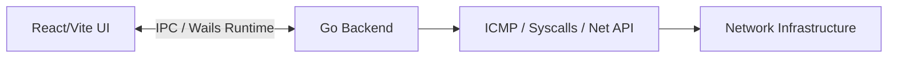

# CatNet Scanner Architecture

This document describes the architectural transition and the current technical stack of **CatNet Scanner**, evolving from a legacy C implementation to a modern Go/Web stack.

## 1. Architectural Paradigm
CatNet Scanner uses **Wails**, which bridges a native Go backend with a modern web frontend. This architecture delivers the performance of a systems language (Go) combined with the UI flexibility of Web technologies (React).

## 2. Go Backend Modules (`pkg/scanner/`)

### `net.go` (Network primitives)
- `func Ping(ip string, timeoutMs int) bool`
  - Sends a native ICMP ping. On Windows, it delegates to the OS `ping` executable with hidden windows to bypass the Raw Socket administrative constraint.
- `func ReverseDNS(ip string) string`
  - Resolves a hostname from an IP address.
- `func GetMAC(ip string) string`
  - Fetches the MAC address of an IP in the local subnet. Uses native Windows `iphlpapi.dll` and `SendARP` via Syscalls for high performance.
- `func ScanPorts(ip string, ports []int, timeoutMs int) []int`
  - Concurrently probes specified TCP ports using `net.DialTimeout`.

### `scan.go` (Concurrency & State)
- `type DeviceInfo`
  - Fields: IP, IsAlive, Hostname, MAC, OpenPortsCount, OpenPorts.
- `func StartScan(...)`
  - Orchestrates a parallel scan using Go channels and WaitGroups (`MaxThreads` goroutines). It emits progress and results back to the frontend synchronously via callbacks.
- `func StopScan()`
  - Cancels the context for the ongoing parallel scan.

### `utils.go` (Parsers)
- `func ParseRange(input string) ([]string, error)`
  - Parses CIDR notations (`192.168.1.0/24`) and dash-separated ranges (`192.168.1.1-254`). Generates a flat slice of target IPs.

## 3. IPC and Frontend Bindings
The backend does **not** expose a standard REST API. Instead, Wails generates direct JavaScript bindings for Go methods inside the `App` struct (e.g., `StartScan`, `StopScan`, `ParseRange`, `ExportCSV`).

- Event-driven updates (`runtime.EventsEmit`) push realtime scan events directly to the React state.
- The frontend consumes events like `scan_started`, `scan_progress`, and `scan_result` to update the Data Table and Progress Bar synchronously.
- The `ExportCSV` function triggers the native `SaveFileDialog` and writes the results locally without requiring browser hacks.

## 4. Legacy C Code
O diretório `legacy_c/` contém a implementação original em C/Raylib do CatNet Scanner. Este código não é mais compilado pelo sistema de build atual e está mantido apenas para referência histórica. Consultar a branch `legacy/c-raylib` para histórico de commits.
