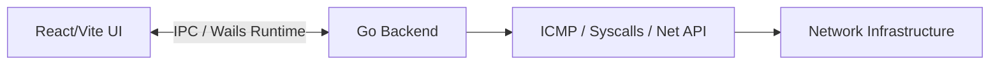

# CatNet Scanner Architecture

This document describes the architectural transition and the current technical stack of **CatNet Scanner**, evolving from a legacy C implementation to a modern Go/Web stack.

## 1. Architectural Paradigm
CatNet Scanner uses **Wails**, which bridges a native Go backend with a modern web frontend. This architecture delivers the performance of a systems language (Go) combined with the UI flexibility of Web technologies (React).

## 2. Backend (Go)
The core logic resides in `pkg/scanner` and is designed around extreme concurrency and low-level system interactions:

### 2.1 Concurrency Model (`scan.go`)
Instead of manual POSIX/Windows threads, we use **Goroutines** to distribute the workload.
* A `StartScan` function accepts a slice of IPs and dispatches them via a buffered Go channel.
* A worker pool (`maxThreads`) consumes the IPs from the channel.
* This model prevents race conditions and eliminates the need for manual mutex locks over the results, ensuring fluid scaling whether scanning a `/24` or `/16` subnet.

### 2.2 Networking Implementations (`net.go`)
To maintain compatibility and bypass the requirement for Administrative privileges (Raw Sockets constraint on Windows), we use specific strategies:
* **Ping**: Utilizes the OS-native `ping` executable (`exec.Command` with `HideWindow: true`) to emit ICMP packets silently.
* **MAC Address / ARP**: Executes native Windows syscalls directly against `iphlpapi.dll` using `SendARP`. This allows us to bypass heavy Cgo dependencies and query MAC addresses natively in a fraction of a millisecond.
* **Port Scanner**: A pure Go `net.DialTimeout` scanner. It's lightweight and async by default.

## 3. Frontend (React + Vite + Bun)
The frontend serves purely as the presentation layer:
* **Framework**: React 18 powered by Vite.
* **Package Manager**: Bun is strictly used instead of Node.js/NPM, drastically reducing build times and CI/CD pipelines duration.
* **Styling**: Handcrafted Vanilla CSS utilizing CSS Variables (`--text-highlight`, `--panel-bg`) to achieve a strict "Glassmorphism Cyberpunk" aesthetic. We actively avoid heavy CSS frameworks to retain a minimal binary footprint.

## 4. IPC (Inter-Process Communication)
The backend does **not** expose a standard REST API. Instead, Wails generates direct JavaScript bindings for Go methods. 
* Event-driven updates (`runtime.EventsEmit`) push realtime scan events directly to the React state.
* The frontend consumes events like `scan_started`, `scan_progress`, and `scan_result` to update the Data Table and Progress Bar synchronously.

## 5. Legacy C Code
The old C codebase (Raylib/Raygui based) is retained inside the `legacy_c/` folder for reference, but it is no longer compiled or tracked by the build system.
