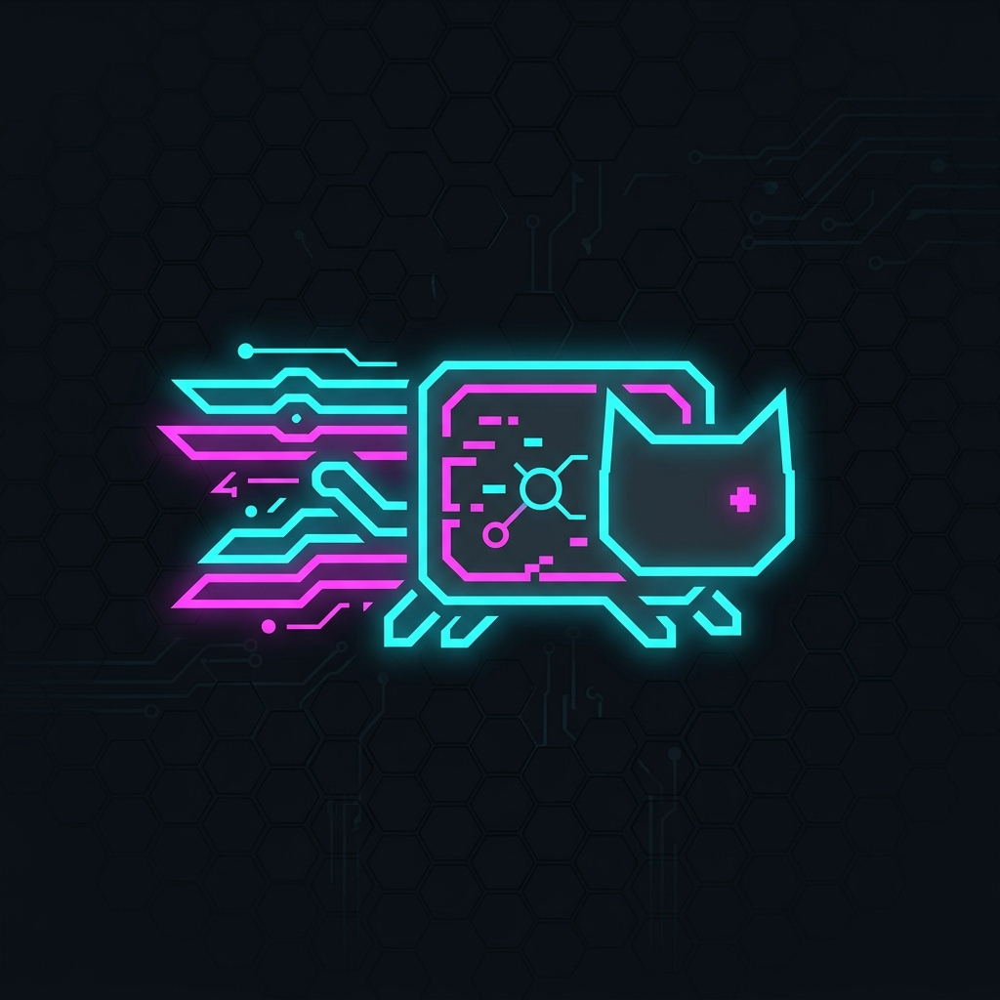
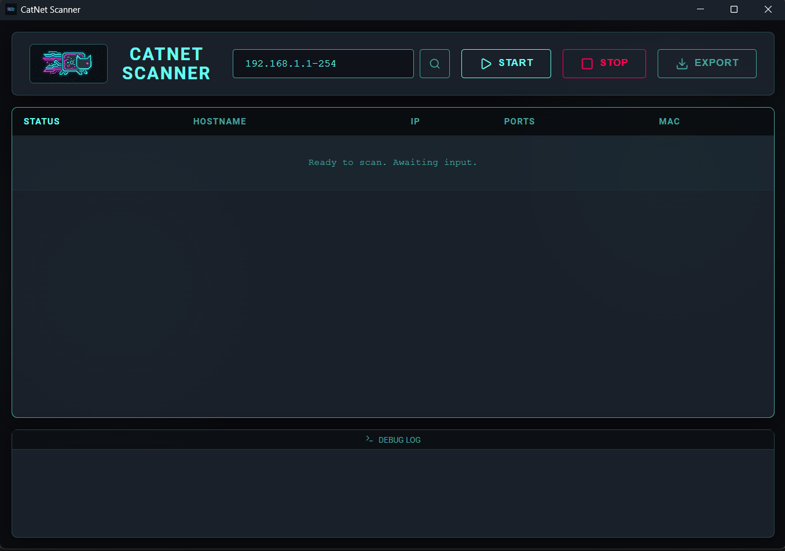

# CatNet Scanner

<p align="center">
  <a href="https://github.com/mendsec/catnet_scanner/actions/workflows/ci.yml"></a>
  <a href="https://github.com/mendsec/catnet_scanner/actions/workflows/govulncheck.yml"></a>
  <a href="https://github.com/mendsec/catnet_scanner/actions/workflows/snyk.yml"></a>
  
</p>
<p align="center">
  

**CatNet Scanner** is an incredibly fast and stylish network scanner, built for anyone who wants the agility of a command-line tool with the beauty of a Cyberpunk/SOC dashboard.

Built on the robust **Go** ecosystem and packaged via **Wails** using **React/TypeScript**, CatNet delivers massively parallel detection without UI lag. The goal? To offer a modern, high-performance alternative to classic tools like Angry IP Scanner—without Java, in a single standalone binary.

## 📸 Interface Preview

<p align="center">
  
  <br>
  <em>CatNet Scanner scanning a subnet with its real-time Glassmorphism UI.</em>
</p>


## 🌟 Features (v0.4.1)

- ⚡ **Brutally Parallel Scan**: Built entirely with Goroutines, scanning entire subnets in a fraction of a second.
- 🎨 **Cyberpunk UI**: A modern React interface using translucent glass (*Glassmorphism*), neon lines, responsive grids, and subtle animations. And of course, with Nyan Cat pulling your progress bar.
- 📡 **Smart Auto-Detect**: Instantly loads the `/24` subnet of your main network interface on startup.
- 💾 **Practical Export**: Save reports in `JSON`, `CSV`, or `XML` format with a single click.
- 🛠️ **Decoupled Architecture**: Secure Go network engine and rich, decoupled React UI, packaged into a single standalone `.exe` file.

## 🛡️ Enterprise-Grade Security & Quality

CatNet Scanner is built with a zero-trust, enterprise-grade security pipeline that runs autonomously via GitHub Actions. We employ top-tier security agents to guarantee the integrity of our codebase:

- **Snyk Security (SCA & SAST)**: Continuously scans both Go and React (Bun) dependencies for vulnerabilities. Snyk also performs static application security testing (SAST) to identify code-level flaws.
- **Govulncheck**: Google's official vulnerability scanner actively monitors our Go standard library and module dependencies against the Go vulnerability database.
- **Dependabot**: Proactively keeps our open-source supply chain updated by creating automated PRs whenever patches are released.
- **Automated CI/CD**: Every pull request must pass a rigorous matrix of builds and tests, ensuring that only verified, secure code is merged.

## 🚀 Upcoming Features

Check our [`ROADMAP.md`](ROADMAP.md) to see where we're heading. Features like Scan Profiles, Custom Openers (SSH, RDP), and Vendor OUI Resolution are already in the works.

## ⚙️ Building and Development

CatNet Scanner uses Wails. You don't need to install heavy React or Node dependencies if you only want to compile the backend.

### Prerequisites
- [Go 1.20+](https://go.dev/dl/)
- [Bun](https://bun.sh/) (fast frontend package manager)
- [Wails CLI](https://wails.io/docs/gettingstarted/installation)

### Installing Wails
```bash
go install github.com/wailsapp/wails/v2/cmd/wails@latest
```

### Running in Development Environment (Live Reload)
To modify the UI or Go code with live-reload, use:
```bash
wails dev
```

### Generating the Production Executable
To compile the final standalone version, run:
```bash
wails build -clean
```
The final executable will be available at `build/bin/catnet.exe`.

---

## 🤝 Contributing
Suggestions are welcome. Feel free to open Issues for new tools you'd like to see in the "Quick Tools" tab or report UI bugs.

> Copyright © 2026 Mendsec. Created by Fábio Mendes.
